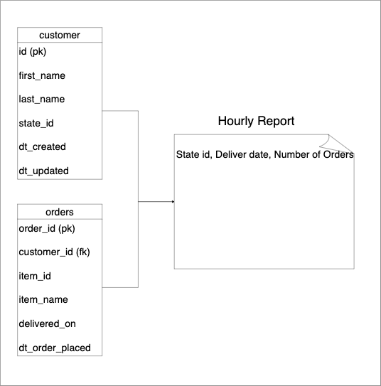
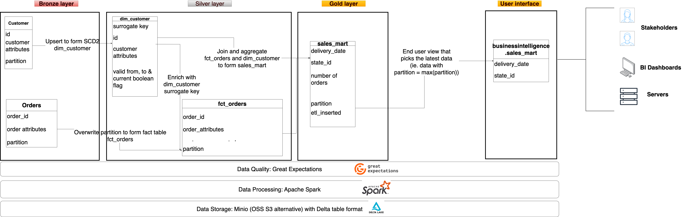

# Data Engineering Best Practices

Code for blog at [Data Engineering Best Practices - #1. Data flow & Code](https://www.startdataengineering.com/post/de_best_practices/)

# Project 

Assume we are extracting customer and order information from upstream sources and creating a daily report of the number of orders. 



# Setup

If you'd like to code along, you'll need 

**Prerequisite:**

1. [git version >= 2.37.1](https://github.com/git-guides/install-git)
2. [Docker version >= 20.10.17](https://docs.docker.com/engine/install/) and [Docker compose v2 version >= v2.10.2](https://docs.docker.com/compose/#compose-v2-and-the-new-docker-compose-command). Make sure that docker is running using `docker ps`
3. [pgcli](https://www.pgcli.com/install)

Run the following commands via the terminal. If you are using Windows, use [WSL](https://ubuntu.com/tutorials/install-ubuntu-on-wsl2-on-windows-10#1-overview) to set up Ubuntu and run the following commands via that terminal.

```bash
git clone https://github.com/josephmachado/data_engineering_best_practices.git
cd data_engineering_best_practices
make up # Spin up containers
make ddl # Create tables & views
make ci # Run checks & tests
make etl # Run etl
make spark-sh # Spark shell to check created tables
```

```scala
spark.sql("select partition from adventureworks.sales_mart group by 1").show() // should be the number of times you ran `make etl`
spark.sql("select count(*) from businessintelligence.sales_mart").show() // 59
spark.sql("select count(*) from adventureworks.dim_customer").show() // 1000 * num of etl runs
spark.sql("select count(*) from adventureworks.fct_orders").show() // 10000 * num of etl runs
:q // Quit scala shell
```

You can see the results of DQ checks, using `make meta`

```sql
select * from ge_validations_store limit 1;
exit
```

Use `make down` to spin down containers.

# Architecture



